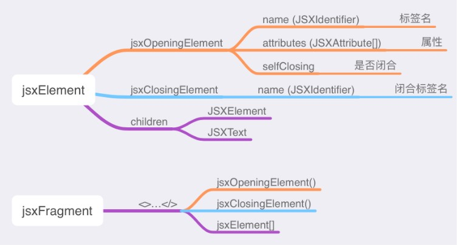

# Babel基础
## 一、Babel基础
 * [浅谈前端AST的概念与实际应用]( https://www.jianshu.com/p/b3f1ff0b3cdf)
 * [babel 插件手册](https://github.com/jamiebuilds/babel-handbook/blob/master/translations/zh-Hans/plugin-handbook.md)
 * https://juejin.cn/post/7045496002614132766
 * https://github.com/estree/estree
  Babel 插件本质上就是编写各种 visitor 去访问 AST 上的节点，并进行 traverse。当遇到对应类型的节点，visitor 就会做出相应的处理，从而将原本的代码 transform 成最终的代码。
  transform 阶段使用 @babel/traverse，可以遍历 AST，并调用 visitor 函数修改 AST，修改 AST 涉及到 AST 的判断、创建、修改等，这时候就需要 @babel/types 了，当需要批量创建 AST 的时候可以使用 @babel/template 来简化 AST 创建逻辑。
 
### 1.1 Babel转译过程
Babel 是一个 JavaScript 的转译器，其执行过程就是一个编译转换的过程。作为一个js转译器，babel暴露了很多 api，利用这些 api 可以完成源代码到 AST 的 parse，AST 的遍历与处理以及目标代码的生成。babel将这些功能的实现放到了不同的包里面，下面逐一介绍。
1. @babel/parser 解析源码得到AST。
2. @babel/traverse 遍历 AST。
3. @babel/types 用于构建AST节点和校验AST节点类型,它是一个用于 AST 节点的 Lodash 式工具库，它包含了构造、验证以及变换 AST 节点的方法；
4. @babel/generate AST生成目标代码和 sorucemap。
5. @babel/template:用以字符串形式的代码来构建AST树节点，快速优雅开发插件

Babel Types 模块是一个用于 AST 节点的 Lodash 式工具库，它包含了构造、验证以及变换 AST 节点的方法。

### 1.2 babel的处理步骤
主要有三个阶段：解析（parse）， 转换 （transform），生成（generate）。

1. parse
将源码转成 AST，用到`@babel/parser`模块。

2. transform
对AST 进行遍历，在此过程中对节点进行添加、更新及移除等操作。因此这是bebel处理代码的核心步骤，是我们的讨论重点，主要使用`@babel/traverse`和`@babel/types`模块。

3. generate
 AST 转换为目标代码并生成 sourcemap，用到`@babel/generate`模块。

## 二、parse
parse可以不传参数
babelParser.parse(code, [options])
 后面的options参数可以默认缺省。
 

### 三、transform遍历
当我们谈及“进入”一个节点，实际上是说我们在访问它们， 之所以使用这样的术语是因为有一个访问者模式（visitor）的概念。
### 2.1  Visitors

 transform遍历AST,使用到了设计模式——访问者模式。

在访问者模式（Visitor Pattern）中，我们使用了一个访问者类，它改变了目标元素的执行算法。通过这种方式，元素的执行算法可以随着访问者改变而改变。而在这里，访问者即是一个用于 AST 遍历的模式， 简单的说它就是一个对象，定义了用于在一个树状结构中获取具体节点的方法。当访问者把它用于遍历中时，每当在树中遇见一个对应类型时，都会调用该类型对应的方法。


示例var全部替换成let:
```javascript
const generator = require('@babel/generator');
const parser = require('@babel/parser');
const traverse = require('@babel/traverse');
const transToLet = code => {
  const ast = parser.parse(code);
  // 访问者对象
  const visitor = {
    // 遍历声明表达式
    VariableDeclaration(path) {
      if (path.node.type === 'VariableDeclaration') {
        // 替换
        if (path.node.kind === 'var') {
          path.node.kind = 'let';
        }
      }
    },
  };
  traverse.default(ast, visitor);
  // 生成代码
  const newCode = generator.default(ast, {}, code).code;
  return newCode;
};
const code = `const a = 1
var b = 2
let c = 3`;
      
```
1. 当创建访问者时你实际上有两次机会来访问一个节点。
```javascript
const MyVisitor = {
  Identifier: {
    enter() {
      console.log("Entered!");
    },
    exit() {
      console.log("Exited!");
    }
  }
};
```


2. 停止遍历
如果你的插件需要在某种情况下不运行，最简单的做法是尽早写回。


3. 

## 四、Babel Types
### 4.1 类型判断
Babel Types 提供了节点类型判断的方法，每一种类型的节点都有相应的判断方法.
例如
> types.isIdentifier(node))  是否为标识符类型节点
 

### 4.2 创建节点
Babel Types 同样提供了各种类型节点的创建方法
1. 创建数据类型，例如：
* types.stringLiteral("Hello World"); // string
* types.numericLiteral(100); // number
* types.booleanLiteral(true); // boolean
* types.nullLiteral(); // null
* types.identifier(); // undefined
* types.regExpLiteral("\\.js?$", "g"); // 正则
 

2. 创建jsx节点，详见下属示例。



## 五、babel/template
template当作为带有字符串参数的函数调用时，您可以提供占位符，这些占位符将在使用模板时被替换。
您可以使用两种不同类型的占位符：句法占位符（例如%name%）或标识符占位符（例如NAME）。@babel/template默认情况下支持这两种方法，但不能混合使用。如果您需要明确说明所使用的语法，可以使用该syntacticPlaceholders (opens new window)选项。
请注意语法占位符是在 Babel 7.4.0 中引入的。如果您不控制@babel/template版本（例如，从@babel/core@^7.0.0对等依赖项导入时），则必须使用标识符占位符。
 ```javascript
const buildRequire = template.default(`
  var IMPORT_NAME = require(SOURCE);
`);
const ast = buildRequire({
  IMPORT_NAME: types.identifier("myModule"),
  SOURCE: types.stringLiteral("my-module"),
});
 const newCode = generator.default(ast).code;
  console.log(newCode);
```