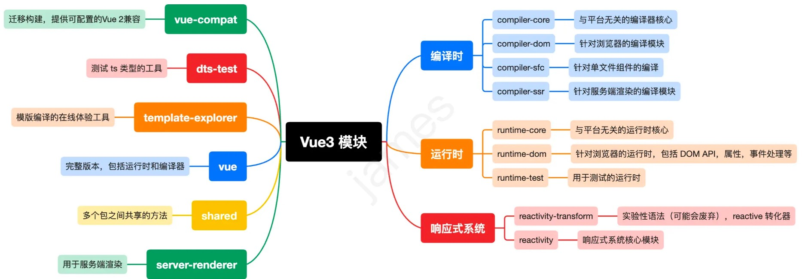

# compiler-dom

 
* https://juejin.cn/post/6958998360787255303
* https://juejin.cn/post/6945435393353318436

## 一、vue3模块
### 1.1 vue3模块结构
[github:vuejs/core](https://github.com/vuejs/core/tree/main/packages/compiler-dom)

### 1.2 compiler模块
compiler也分为comoiler-core和在针对各个平台的compiler，如：
compiler-dom、compiler-sfc、compiler-ssr，其中各个平台的compiler内部还是调用到compiler-core方法。

* compiler-dom：浏览器
* compiler-sfc：单文件组件
* compiler-ssr：服务端渲染

### 1.3 compiler-dom
是针对浏览器的编译模块
compile函数内部调用了baseCompile。baseCompiler就是来源于compiler-core
 

### 二、template的ast节点结构

template编译成AST后
在上面template转成ast结果里根节点  我们看到有3个属性：

* type : 节点类型
* children：子节点
* loc：位置信息和当前源码

children是一个数组对象，包含着标签语法的信息描述，通常有以下属性：

* type : 节点类型
* children：子节点
* loc：位置信息
* tag：标签名
* isSelfClosing：是否自闭和标签
* props：属性集合
* isStatic：是否是静态属性
* content：内容
 