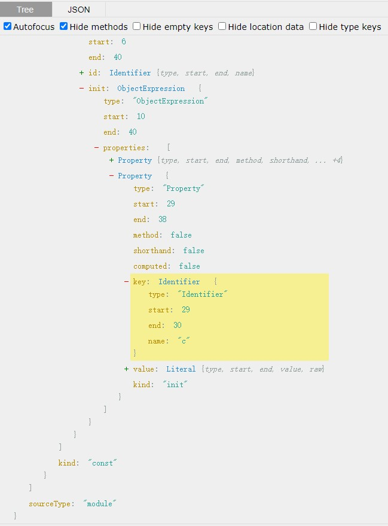
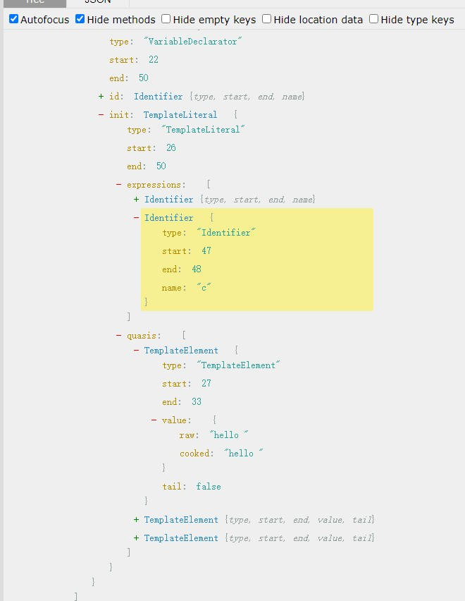

# 技术方案介绍
## 一、介绍
### 1.1应用到的技术 
1. 主要使用了@vue/compiler-sfc，进行vue的代码提取
2. 利用babel工具,对js代码进行ast遍历处理
3. 利用MD5针对含中文字符串换生成hash值,进行替换
### 1.2 主要处理逻辑
getFiles       -> scanFiles              ->buildResult
             scanFiles:scanSingleFiles
1. 扫描目标文件夹生成全部文件地址
2. 根据文件地址逐个读取文件,对含中文字符串换生成hash值,进行替换,并生成的hash值和字符串对应字典
3. 根据hash值和字符串对应字典，调用接口进行翻译,将两个对应字典存储

## 1.3 getFiles       
遍历目标文件夹获取并保存符合要求的全部文件地址
### 1.4 scanFiles
遍历全部文件地址，对文件进行读取，调用scanSingleFiles 处理之后获得处理之后的文件

## 二、scanSingleFiles          
### 1.1 基本流程
 isVue?
   transformJS gengerateJs 
 parseVue获得descriportor     
    
      transformTemplate gengerateTemplate
      transformjs gengerateJs
      generateSfc


### 1.2 

## 三、transformJS
1. 使用`@babel/parser`将代码转化为ast,然后使用`@babel/traverse`对ast进行遍历，对代码进行中文字符串替换为hash值的处理
2. visitor处理逻辑
````javascript
const visitor = {
  Program:{
    //整段代码主体
    exit:(path)=>{
      //只在exit的时候进行访问
    }
  },
  ObjectExpression:{
    //对象表达式
     exit:(path)=>{
      /****
       * 当前父级调用函数名为Vue时候,在对象表达式中增加i8n:'i18n'的键值对
       * **/
     }
  },
  StringLiteral:{
    //字符串型字面量
    exit:(path)=>{
      /****
       * value = path.node.value
       * if(含html且含有中文字符){
       *   tags = 扫描识别单引号双引号<>中间的中文字符
       *    value = value替换掉全部tags中的中文字符,再使用$-$-$分隔的数组
       *   tags遍历逐个生成hash的$t表达式，使用$t表达式和value生成模板字符串 
       *  节点替换成模板字符串
       * }else if(不含html且含有中文字符){
       *   节点替换成 value生成hash的$t表达式
       * }
       * **/
    }
  },
  TemplateLiteral:{
    //模板字符串
    exit:(path)=>{
      /****
       * node.path.expression是${}变量部分
       * node.path.quasis([0].cooked) 是字符串部分
       * let value = 提取纯字符串 
       * if(value含html){
       *   if(value含有中文字符){
       *      警告手动处理
       *   }
       * }else if(value不含html且含有中文字符){
       *   let replaceStr = 提取纯字符串并用%s拼接
       *   使用replaceStr生成MD5的hash值,
       *   生成调用表达式$extend('hash',[xxx])替换掉模板字符串
       *   
       * }
       * **/
    }
  }

}
````
ObjectExpression示例结构
Properties
```javascript
const a = {
  b:2,
  c:'hello'
}
```



TemplateLiteral示例结构
expression和quasis
```javascript
const b = 1,c=2
const a = `hello ${b} to meet${c}`

```



### 五、transformTemplate
接收参数为ast和
children type含义：
* type:1 元素,如div,p,label等
* type:2 字符空格等
* type:5 插值语法，{{}}里面的内容
props type含义：
* type:6 普通属性，如class,title,text等
* type:7 vue指令  比如v-model


#### 5.1 chilren遍历之后每个节点的处理
1. type:2
   插值替换

2. type:5
    {{}}里面的内容,类型为5，可能是一个表达式：比如三元表达式
    使用transformJS和generation进行一次转换,然后
3. type:1
    继续循环children


### 六、 gengerateJs
使用`@babel/generate`将ast转化为代码
### 七、 parseVue 
使用compiler-sfc提供的parse方法

### 八、generateSfc
利用descriptor上各个模块，如tempalte,script,setupScript,styles,customeBlock,
利用个模块的type和content,进行标签拼接生成vue3文件的代码

并利用prettier进行代码格式化

### 九、buildResulte
             
    
### 十、函数

````javascript
  
$t = (key)=>{
  i18n.$e(key)
} 
$extend = (key,values)=>{
  i18n.$e(key,values)
}  
````
         