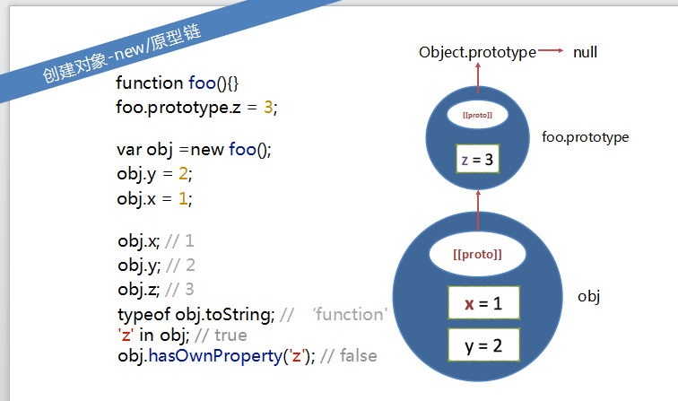
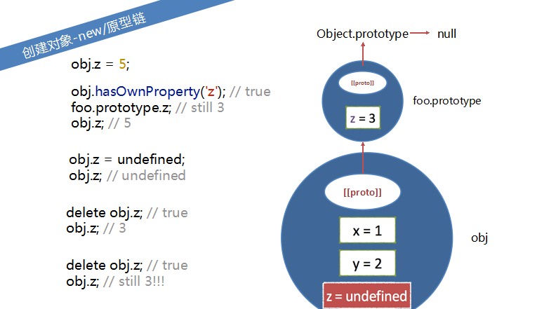
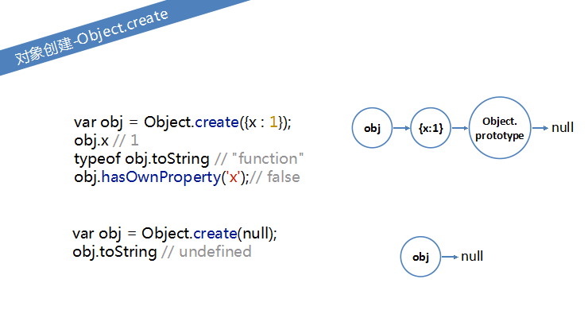
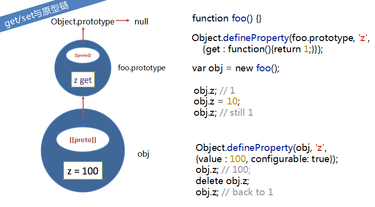
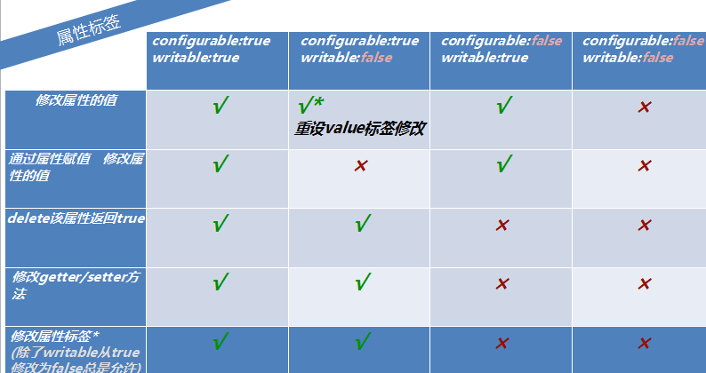

## 五、JS对象概述

### 5.1 概念：

 对象中包含一系列的属性，这些属性是无序的，每个属性都有一个字符串key和对应的value。

    ```javascript
        var obj={x:1,y:2};
        obj.x;
        obj.y;
    ```

1. 关于key，无论是把数字还是别的设置为key，实际上都会先先转化为字符串，然后才作为实际上的key;
  如示例中的key为1时，实际上是转化为字符串`1`作为key的；其中有方括号表示法和点表示法两种方法；方括号表示法的好处是可以通过变量来访问属性.
    ```javascript
        var obj={};
        obj[1]=1;

        obj["1"];

        obj[{}]=3;
        obj;

        var obj1={"x":1,y:2};
        obj1;
    ```

2. js对象中的属性是可以动态添加和删除的
3. js对象中每一个属性都有writable、enumerable、configurable 、value的标签，还提供了Get/set方法，这些东西可以为每一个属性提供一些访问权限的控制;（对应于属性所以可以说是属性标签）

4. 对象的三个属性：
   * 每个对象都有一个原型(prototype)
   * 都有一个`[{class}]`标签来表示它是属于哪一个种类的
   * 还有一个`[{extensible}]`标签来表示这个对象是否允许继续添加新的属性；(对应于对象，可以说是对象标签).

### 5.2 原型背景基础了解
 1. 原型prototype,每一个对象自己都会有一个属性prototype，它是一个对象属性
 2. 隐式原型__proto__:隐式原型指向构造该对象的构造函数的原型（prototype）
 3. 万物皆对象,包括Function,Date等,prtotype都继承自Object.prototype
 4. Object.prototype是null

### 5.2 创建对象：

创建对象的方法：包括一下三种

#### 5.2.1. 创建对象-字面量：
`var obj2 = {    x : 1,    y : 2,    o : {        z : 3,        n : 4    }};`

#### 5.2.2. 创建对象-new：

 
1.  用new方法构造一个对象，它的特点是它的原型会指向它的构造器的prototype属性

 构造函数的原型
 ```javascript
   function foo(){}
   foo.prototype.z = 3;
   
   var obj = new foo();
   obj.y = 2;
   obj.x = 1;
   obj.x ;//1
   obj.y;//2
   obj.z;//3
   typeof obj.toString;//function
   'z' in obj;//true
   obj.hasOwnProperty('z')//false
 ```
 


 关于 toString的解释：在对象原型链的末端都会有一个Object.prototype,而toString是在prototype上，所以可以通过toString拿到function

2. 再上一个图的基础上继续做如下图操作:
```javascript
obj.z = 5;
obj.hasOwnProperty('z');//true
foo.prototype.z;//3
obj.z;//5

obj.z= undefined;
obj.z;//undefined

delete obj.z;
obj.z;//3
 
delete obj.z
obj.z;//3 

```



说明obj.z在使用时，如果obj本身没有，就会沿着原型链向上查找；如果给obj添加上一个z的属性，也不会影响foo.prototype.z

#### 5.2.3. 创建对象-object.create
1. 他是一个系统内置的静态函数，创建一个新的对象。接收一个参数，一般是一个对象，它会返回一个新创建的对象，并让这个对象的原型指向这个参数，也就是说传入的参数是所创建对象的原型。
```javascript
var obj = Object.create({x:1});
obj.x;//1
typeof obj.toString();//'function'

//传入null创建一个没有原型的对象
var obj = Object.create(null);
obj.toString()//undefined
```



### 5.3. 属性的特性
1. 可以认为一个属性包含一个名称和4个特性,4个特性分别是它的值（value）,可写性(writable),可枚举性（enumerable）和可配置性(configurable)。
 但是存取器属性(get/set)除外。

* `[[configurable]]`:表示能否使用delete操作符删除从而重新定义，或能否修改为访问器属性。默认为true;
* `[[enumerable]]`:表示是否可通过for-in循环返回属性。默认true;
* `[[writable]]`:表示是否可修改属性的值。默认true;
* `[[value]]`:包含该属性的数据值。读取/写入都是该值。
2. 通过`Object.getOwnPropertyDescriptor`可以获得某个对象的特定属性的属性描述符
3. 要想获得继承属性的特性，需要便利原型链`Object.getPrototypeOf()`
4.  设置属性特性：`Object.defineProperty()`


 <!-- 删除属性  枚举属性  检测属性  属性异常  -->

### 5.4、读写对象属性:


#### 5.4.1 属性读写

```javascript
 //属性读写
 var obj={x:1,y:2};
 obj.x;//1
 obj["y"];//2

 obj["x"]=3;
 obj.y=4;

 var obj={x1:1,x2:2};
 var i=1;n=2;
 for(;i<=n;i++){
     console.log(obj['x'+i]);
 }//1,2

 var p;
 for(p in obj){
     conosle.log(bj[p]);
 }
```

#### 5.4.2 属性删除
 `configurable`是false的属性是不可删除的, 比如 
 1. prototype,
 2. 通过变量声明和函数声明创建的全局对象的属性
 *  用var定义的全局变量不可删除;
 *  在函数中用var定义的局部变量也不可删除，当然函数更不会被删除

```javascript
//属性删除
var person={age:29,title:"fe"};
delete person.age;//true
delete person["title"]//true;
person age;//undefined
delete person.age;//true

delete Object.prototype;//false

var descriptor=Object.getOwnPropertyDescriptor(Object,"prototype");
descriptor.configurable;//false
```

特例:通常情况下，使用var去声明的变量，不能被delete，例如：
```javascript
var abc = 100;
delete abc; // 返回false
 abc; // 还是100
```

但是在eval代码里，就会不同，例如：

```javascript
eval("var abc = 100;console.log(delete abc); console.log(abc);"); // 返回true,  abc is not defined...
```

#### 5.4.3 属性检测
 判断某个属性是否存在于某个对象上：
 1. `in` 对象的自有属性或继承属性是否存在
 2. `hasOwnProperty` 是否是自有属性
 3. `propertyIsEnumerable` 是自有属性且属性的可枚举性是true的时候，返回true

 或者直接属性查询也可以

```javascript
//属性检测
var cat = new Object;
cat.legs = 4;
cat.name = "kitty";

'legs' in cat;//true
'abc' in cat;//false
'toString' in cat;//true inherited property!!!

cat.hasOwnProperty('legs');//true
cat.hasOwnProperty('toString');//false
cat.propertyIsEnumerable('legs');//true
cat.propertyIsEnumerable('toString');//false
```


#### 5.4.5 属性枚举

 1. `for in` 便利对象的自有属性或继承属性
 2. `Object.keys()` 返回可枚举的自有属性的名称
 3. `Object.getOwnpropertyNames()`返回自有属性的名称
```javascript
//属性枚举
var o={x:1,y:2,z:3};
'toString' in o;//false
o.propertyIsEnumerabe('toString');//false

var key;
for(key in o){
    console.log(key);//x,y,z
}

var obj=Object.create(o);
obj.a=4;
var key;
for(key in obj){
    cnsole.log(key);//a,x,y,z
}

var obj=Object.create(o);
obj.a=4;
var key;
for(key in obj){
    if(key in obj){
        if(cat.hasOwnProperty(key)){
            console.log(key);
        }
    }
}
```

#### 5.4.6  定义属性特性 `Object.defineProperty()`,
`Object.defineProperty(obj, prop, descriptor)`方法接收三个参数：需要添加或修改属性的对象，属性名称，属性描述options。
由于undefined==null,所以想让属性值不等于undefined，就要使用！==

```javascript
//属性检测
Object.defineProperty(cat,'price',{enumberable:false,value:1000});
cat.propertyIsEnumerable('price');//false
cat.hasOwnProperty('price');//true

cat.propertyIsEnumerable('toString');//false
if(cat&&cat.legs){
    cat.legs *=2;
}
if(cat.legs!=undefined){
    //!==undefined,or,!==null
}
```


#### 5.4.7 getter/setter方法

1. 属性getter/setter方法

```javascript
//属性getter/setter方法
var man={
    name:'Bosn',
    weibo:'@Bosn',
    get age(){
        return new Date().fullYear()-1988;
    },
    set age(val){
        console.log('Age cant be set to'+val);
    }
};
console.log(man.age);//27
man.age=100;//
console.log(man.age);//27
```

2. get/set与原型链



### 5.5、属性级的权限设置

Object.getOwnPropertyDescriptor()方法可以取得给定属性的特性：
 

### 5.6、对象标签

对象有三个标签：
 [{proto}] 原型标签、
[{class}]类、
[{extensible}]可扩展性

#### 5.6.1. 原型标签

#### 5.6.2 类

#### 5.6.3. 可扩展性
对象的扩展性用以表示是否可以给对象添加新属性

1. `Object.esExtensible()` 判断对象是否可扩展
2. `Object.preventExtensions()`将对象转换为不可扩展
3. `Obejct.seal()`和 `Obejct.osSealed()`将对象设置为不可扩展，且对象自有属性都设置为不可配置
4.  `Obejct.freeze()`和`Obejct.isFrozen()`将对象设置为不可扩展，且对象自有属性都设置为不可配置，且将所有自有数据属性设置为只读

### 5.7、 序列化
对象序列化指的是将对象的状态转换为字符串，也可将字符串还原为对象，
ES5提供了`JSON.stringfy()`和`JSON.parse()`来序列化和还原对象。
JSON是javascript的子集,并不能表示js中所有的值，规则如下：
1. 函数，regExp和undefined，不能序列化和还原
2. 如果属性值NaN,infnity,将会转化为null，如果是时间，将会转化成UTC的时间格式

```javascript
//序列化
var obj={ x:1, y:true,z:[1,2,3],nullVal:null};
JSON.stringify(obj);
//"{"x":1,"y":true,"z":[1,2,3],"nullVal":null}"

var obj={ val:undefined,a:NaN,b:Infinity,c:new Date()};
JSON.stringify(obj);
//"{"a":null,"b":null,"c":"2016-12-22T14:31:58.240Z"}"

var obj=JSON.parse('{"x":1}');
JSON.stringify(obj);//"{"x":1}"
```
 

3. 序列化自定义

```javascript
var obj={
    x:1,
    y:2,
    o:{
        o1:1,
        o2:2,
        toJSON:function(){
             return this.o1+this.o2
        }
    }
};
JSON.stringify(obj);
//"{"x":1,"y":2,"o":3}"
```


## 六、js对象的特点,js对象和json的一些对比比较

### 6.1 js对象的特点:

1. JS对象不依靠类而存在，可直接生成
　　总结：Js中的对象，就是“一组属性与值的集合”，属性可以任意添减，方法和属性不必区分
2. JS面向对象的私有属性和封装
    通过闭包来完成js面向对象的私有属性和封装

```javascript
function girl(name,bf){
    var secret=bf;
    this.name=name;
    this.showlove=function(){
        return secret;
    }
}
var g=new girl('lindaiyu','jiabaoyu');
alert(g.name+'xihuan'+g.showlove())
```

### 6.2 js对象和json的一些对比比较:

　关于JSON（JavaScript Object Natation），简单的说就是轻量级的用于交换数据的格式，基于javascript 语法的子集，即数组和对象表示。
　每一个数据都是一对键和值，用 , 分隔开。每一个键和值用 :分割开。
　json 里的键和 Javascript 的对象标识符是不同的概念，必须用双引号包裹包裹。在 Javascript 对象里，对象标识符可以不用引号，用单引号或双引号。string 可以用单引号或双引号来表现。而在 json 的 概念里的 string，其表现形式为必须用双引号包裹。
 通过`eval()`函数可以将JSON字符串转化为对象。 


## 九、JS面向对象之静态方法

```javascript
 var harshiqi=function(){
    this.bark=function(){
        alert("wangwang");
    }
 }

harshiqi.ajax=function(){
    alert("ajax");
 }
 var h=new harshiqi();
 console.log(h);
 //H中没有ajax方法
 /*
 即:
 ajax()方法是基于”函数“本身的，和返回的对象没有关系
 bark要调用，必须要new harshiqi()得到对象，切有返回对象才能调用
使用ajax()方法要调用，不需要new对象，直接用harshiqi调用
 */
 h.bark();
 harshiqi.ajax()
```
* 之前是否接触过静态方法？
1. Math.random():静态方法
2. $.ajax():静态方法
3. 写jquery插件，2种办法
   * 通过闭包，把方法写到jquery原型上
   * 直接增加$的静态方法


