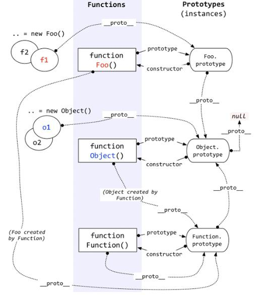

## 七、原型：prototype和__proto__

### 7.1 对prototype和__proto__的理解:

[javascript核心指南](http://www.cnblogs.com/ifishing/archive/2010/12/08/1900594.html) 

一个对象的隐式原型指向构造该对象的构造函数的原型,
如果一个对象没有明确指定原型，那`__proto__`的默认值为 `Object.prototype`。对象 `Object.prototype` 自身也有一个`__proto__`，它是整个原型链的 最后一环(final link)并且值为 null. 

链接：
[prototype和__proto__的关系](https://www.zhihu.com/question/34183746/answer/58155878) 

1. 首先，要明确几个点：在JS里，万物皆对象。方法（Function）是对象，方法的原型(`Function.prototype`)是对象。因此，它们都会具有对象共有的特点。即：对象具有属性`__proto__`，可称为隐式原型，一个对象的隐式原型指向构造该对象的构造函数的原型，这也保证了实例能够访问在构造函数原型中定义的属性和方法。
方法(Function)这个特殊的对象，除了和其他对象一样有上述`_proto_`属性之外，还有自己特有的属性——原型属性（`prototype`），这个属性是一个指针，指向一个对象，这个对象的用途就是包含所有实例共享的属性和方法（我们把这个对象叫做原型对象）。原型对象也有一个属性，叫做constructor，这个属性包含了一个指针，指回原构造函数。
好啦，知道了这两个基本点，我们来看看上面这副图。
  + 1.构造函数Foo()构造函数的原型属性Foo.prototype指向了原型对象，在原型对象里有共有的方法，所有构造函数声明的实例（这里是f1，f2）都可以共享这个方法。
  + 2.原型对象Foo.prototype,Foo.prototype保存着实例共享的方法，有一个指针constructor指回构造函数。
  + 3.实例f1和f2是Foo这个对象的两个实例，这两个对象也有属性__proto__，指向构造函数的原型对象，这样子就可以像上面1所说的访问原型对象的所有方法啦。另外：构造函数Foo()除了是方法，也是对象啊，它也有__proto__属性，指向谁呢？指向它的构造函数的原型对象呗。函数的构造函数不就是Function嘛，因此这里的__proto__指向了Function.prototype。其实除了Foo()，Function(), Object()也是一样的道理。原型对象也是对象啊，它的__proto__属性，又指向谁呢？同理，指向它的构造函数的原型对象呗。这里是Object.prototype.最后，Object.prototype的__proto__属性指向null。

2. 总结：
  + 1.对象有属性__proto__,指向该对象的构造函数的原型对象。
  + 2.方法除了有属性__proto__,还有属性prototype，prototype指向该方法的原型对象。

### 7.2 判定原型关系常用方法

1. 判断对象与原型对象的关系：`isPrototypeOf()`;
2. 检测一个属性是存在于实例中，还是存在于原型：`hasOwnProperty()`
   只有给定属性存在于对象实例中时，才会返回true;
3. `Object.getPrototypeOf()`:返回[[protype]]的值;
4. typeof 和instanceof的区别
    * typeof 是一个一元运算，放在一个运算数之前，运算数可以是任意类型。
    * 它返回值是一个字符串，该字符串说明运算数的类型。typeof 一般只能返回如下几个结果：number,boolean,string,function,object,undefined。我们可以使用 typeof 来获取一个变量是否存在，如 `if(typeof a!="undefined"){alert("ok")}`，而不要去使用 `if(a) `因为如果 a 不存在（未声明）则会出错，对于 Array,Null 等特殊对象使用 typeof 一律返回 object，这正是 typeof 的局限性。
    * instanceof 用于判断一个变量是否某个对象的实例，如 `var a=new Array();alert(a instanceof Array); `会返回 true，同时` alert(a instanceof Object) `也会返回 true;这是因为 Array 是 object 的子类。再如：`function test(){};var a=new test();alert(a instanceof test)` 会返回true

