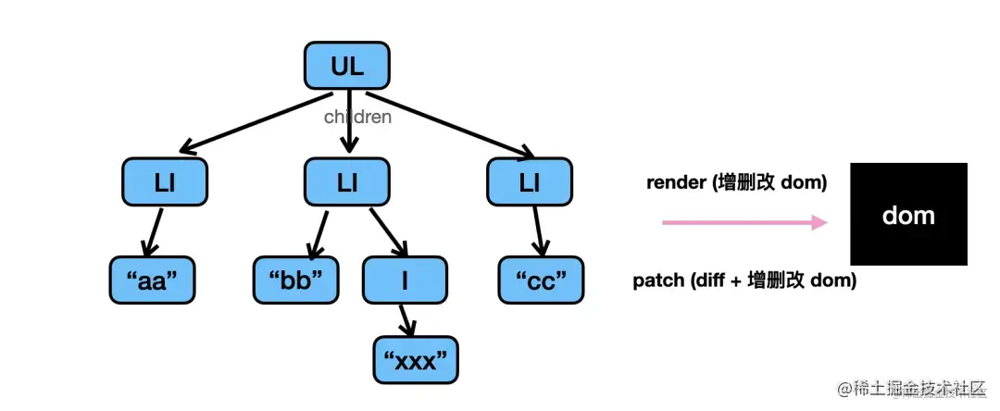
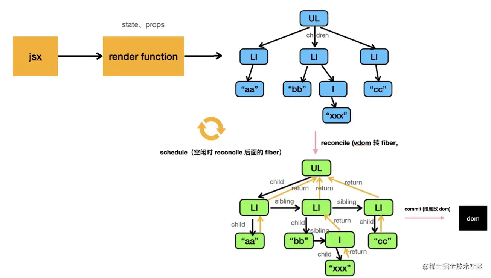

# fiber

react 是通过 jsx 描述界面的，它会被 babel 或 tsc 等编译工具编译成 render function，然后执行产生 vdom：

React16 引入了 fiber 架构之后就多了一步：首先把 vdom 转成 fiber，之后再渲染 fiber。

神的两篇文章不大严谨啊,

reconcile(调和/协调器)：不止包括vdom 转 fiber 的过程,还有diff等都在其中
最后增删改真实 dom 的过程叫做 commit。
reconcile(调和)对应的是render阶段
commit阶段则对应Renderer（渲染器）

这样，之前只有 vdom 的 render 和 patch，现在却变成了 vdom 转 fiber 的 reconcile，空闲调度 reconcile 的 scheduler，最后把 fiber 渲染的 commit 三个阶段。

关于以上神的两篇文章说法的疑问：
1.文中的虚拟dom 其实应该指的是ReactElement树，真正的虚拟dom 应该在completeUnitOfWork阶段生成
2.scheduler只管调度任务，他会把当前优先级最高的任务送去reconciler去构造fiber 树，
reconcile的过程是vdom转fiber的过程，转换之后才是链表关系，有了链表关系才能中断，为啥转的过程可以中断？

 存疑的两篇参考文章：
[手写简易版 React 来彻底搞懂 fiber 架构](https://juejin.cn/post/7063321486135656479)
[React Hooks 的实现必须依赖 Fiber 么？](https://juejin.cn/post/7087172219226292237)