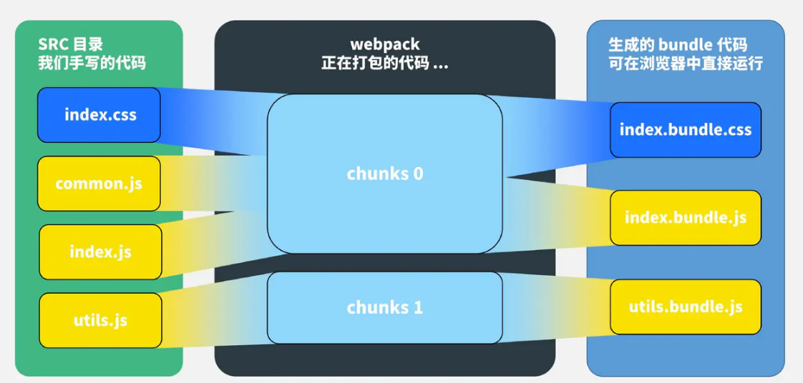
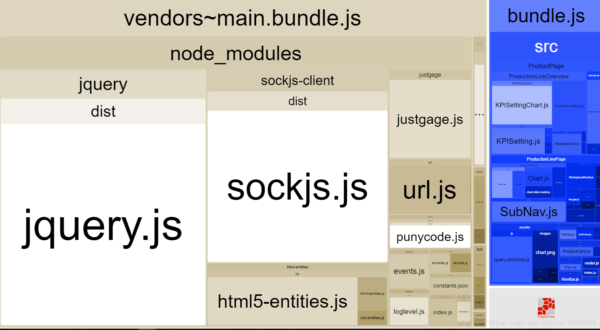

## 一、构建工具
### 1.构建
构建:将源代码转换成可执行的JavaScript、css、HTML代码，包括如下内容。
* 代码转换：比如将TypeScript编译成JavaScript、将scss编译成css等。
* 文件优化：压缩JavaScript、css、HTML代码，压缩合并图片等。
* 代码分割：提取多个页面的公共代码，提取屏不需要执行部分的代码让其异步加载。
* 模块合并：在采用模块化的项目里有很多个模块和文件，需要通过构建功能将模块分类合并成一个文件。
* 自动刷新：监听本地源代码的变化，自动重新构建、刷新浏览器。
* 代码校验：在代码被提交到仓库前需要校验代码是否符合规范，以及单元测试是否通过。
* 自动发布：更新代码后，自动构建出线上发布代码并传输给发布系统。
构建其实是工程化、自动化思想在前端开发中的体现，将一系流程用代码去实现，让代码自动化地执这一系列复杂的流程。

### 2.工具

* grunt：任务执行
* gulp：基于流的自动化构建工具
* webpack：打包模块化JavaScript 
* RollUp：和 Webpack 很类似但专注于 ES6 的模块打包工具
在实践中：也可以根据需求，结合使用这些工具


## 二、webpack 
### 1.webpack版本发展历史
 webpack v0.1.0(8 year ago)->webpack3(3 years ago)->webpack4(2 years ago)->webpack5(目前还未发布正式版 目前有beta版本可以尝试)
 
 升级过程中一些包和使用语法有调整，内置了很多优化，引入了一些其他构建工具的优点，比如rollup的treeShaking等一些好的东西进来，但是基础结构和思路是不变的

### 2.概念
* Entry ：入口， Webpack 执行构建的第一步将从Entry开始，可抽象成输入。
* Module ：模块，在Webpack 里一切皆模块， 一个模块对应一个文件。Webpack 会从配置的Entry 开始，递归找出所有依赖的模块。
* Chunk ：代码块， 一个Chunk 由多个模块组合而成，用于代码合并与分割。
* Loader ： 模块转换器，用于将模块的原内容按照需求转换成新内容。
* Plugin ： 扩展插件，在Webpack 构建流程中的特定时机会广播对应的事件，插件可以监听这些事件的发生，在特定的时机做对应的事情。



[基本概念](https://juejin.im/post/5cede821f265da1bbd4b5630#heading-6)

### 3.流程概括
Webpack 的运行流程是一个串行的过程，从启动到结束会依次执行以下流程。
* 初始化参数： 从配置文件和Shell 语句中读取与合并参数，得出最终的参数。
* 开始编译：用上一步得到的参数初始化Compiler 对象，加载所有配置的插件，通
过执行对象的run 方法开始执行编译。
* 确定入口： 根据配置中的entry 找出所有入口文件。
* 编译模块：从入口文件出发，调用所有配置的Loader 对模块进行翻译，再找出该
模块依赖的模块，再递归本步骤直到所有入口依赖的文件都经过了本步骤的处理。
* 完成模块编译： 在经过第4步使用Loader翻译完所有模块后， 得到了每个模块被
翻译后的最终内容及它们之间的依赖关系。
* 输出资源：根据入口和模块之间的依赖关系，组装成一个个包含多个模块的Chunk,
再将每个Chunk 转换成一个单独的文件加入输出列表中，这是可以修改输出内容
的最后机会。
* 输出完成：在确定好输出内容后，根据配置确定输出的路径和文件名，将文件的内
容写入文件系统中。

在以上过程中， Webpack会在特定的时间点广播特定的事件，插件在监听到感兴趣的
事件后会执行特定的逻辑，井且插件可以调用Webpack

Webpack 的构建流程可以分为以下三大阶段。
* 初始化：启动构建，读取与合并配置参数，加载Plugin ，实例化Compiler 。
* 编译：从Entry 发出，针对每个Module 串行调用对应的Loader 去翻译文件的内容，
再找到该Module 依赖的Module ，递归地进行编译处理。
* 输出：将编译后的Module 组合成Chunk ，将Chunk 转换成文件，输出到文件系统中。
如果只执行一次构建，则以上阶段将会按照顺序各执行一次。但在开启监昕模式下，
流程将变为如图 所示。


### 4.打包结果
 
打包输出的js代码其实是一个立即执行函数，可以简写如下：

````javascript
(function(modules) {
  // 模拟require 语句
  function _webpack_require_() {
  //执行存放所有模块数组中的第0 个模块
  _webpack_require_(0);
}) (［/＊存放所有模块的数组＊/) 
````

bundle.js能直接运行在浏览器中的原因是，在输出的文件中通过_webpack_require_ 函数，定义了一个可以在浏览器中执行的加载函数，来模拟Node.js中的require语句。
原来一个个独立的模块文件被合并到了一个单独的bundle.js 的原因是，浏览器不能像Node.js那样快速地在本地加载一个个模块文件，而必须通过网络请求去加载还未得到的文件。如果模块的数量很多，则加载时间会很长，因此将所有模块都存放在了数组中，执行一次网络加载。
 
仔细分析＿webpack_require_函数的实现，我们还会发现Webpack做了缓存优化：执行加载过的模块不会再执行第2次，执行结果会缓存在内存中，当某个模块第2次被访问时会直接去内存中读取被缓存的返回值。


## 三、webpack3.0->4.0升级中的注意事项
一些老项目中已经从webpack3.0->升级到4.0,需要调整的配置

###  3.1 环境及依赖库更新
检查依赖的最低版本:npm-check git-log

###  3.2 mode环境区分  
 
--mode 模式 (必选，不然会有 WARNING)，是 webpack4 新增的参数选项，默认是 production(development、production、none)

1. mode production 生产环境
* 提供`uglifyjs-webpack-plugin`代码压缩
* 不需要定义`new webpack.DefinePlugin({ "process.env.NODE_ENV": JSON.stringify("production") })`  默认 production
* 默认开启`NoEmitOnErrorsPlugin -> optimization.noEmitOnErrors` , 编译出错时跳过输出，以确保输出资源不包含错误
* 默认开启`ModuleConcatenationPlugin -> optimization.concatenateModules` , webpack3 添加的作用域提升(Scope Hoisting)

2. mode development 开发环境
* 使用 eval 构建 module, 提升增量构建速度
* 不需要定义`new webpack.DefinePlugin({ "process.env.NODE_ENV": JSON.stringify("development") })`  默认 development
* 默认开启 ` NamedModulesPlugin -> optimization.namedModules ` 使用模块热替换(HMR)时会显示模块的相对路径

区分版本，完成了一些功能集成，比如再次之前压缩混淆代码，需要增加uglify插件，作用域提升(scope hosting)需要增加ModuleConcatenationPlugin。而在 webpack4 中，只需要设置 mode 为 production即可
当然也要注意很多配置也只会在prduction下生效，比如treeShaking,scope hosting等。

### 3.3 Webpack 4.x 的破坏性变更

原来uglifyjs-webpack-plugin、optimize-css-assets-webpack-plugin配置在plugins中，现在修改为optimization.minimizer中配置
另外还有一些插件的失效或配置调整，如extract-text-webpack-plugin插件已经不支持webpack4，废弃了。提供的是mini-css-extract-plugin这个插件来做替代品

| 失效的插件或loader   | 类型  |功能说明  |
|  ----  | ----  |----  |
| webpack.optimize.CommonsChunkPlugin  |  内置插件 | 分离Chunk。将多次出现的代码统一打包到一个文件中。Vue工程中用来打包vendor及mainfest |
| webpack.optimize.UglifyJsPlugin	  | 内置插件 |压缩JS |
| extract-text-webpack-plugin  | Loader |分离文件。将部分代码或文件提取到单独文件中。Vue工程里用来分离CSS到指定文件 |	

		
 [webpack4升级](https://blog.csdn.net/harsima/java/article/details/80819747)
		
 


## 四、兼容低版本浏览器
   见`babel.md`


 ## 五、优化
 ### 5.1.tree shaking
作用：去掉项目中的死代码

为了学会使用 tree shaking，你必须
1. 使用 ES2015 模块语法（即 import 和 export）。
2. 引入一个能够删除未引用代码(dead code)的压缩工具(minifier)（例如 UglifyJSPlugin/TerserPlugin）。
3. sideEffects标识和配置
一个很好的例子就是全局样式表，或者设置全局配置的JavaScript 文件。Webpack 认为这样的文件有“副作用”。具有副作用的文件不应该做 tree-shaking，因为这将破坏整个应用程序。Webpack 的设计者清楚地认识到不知道哪些文件有副作用的情况下打包代码的风险，因此默认地将所有代码视为有副作用。这可以保护你免于删除必要的文件，但这意味着 Webpack 的默认行为实际上是不进行 tree-shaking。幸运的是，我们可以配置我们的项目，告诉 Webpack 它是没有副作用的，可以进行 tree-shaking。 
* 在项目 package.json 文件中，添加一个 "sideEffects" 入口。
* Webpack使用它的模块规则系统来控制各种类型文件的加载
````javascript
// 所有文件都有副作用，全都不可 tree-shaking
{
 "sideEffects": true
}
// 没有文件有副作用，全都可以 tree-shaking
{
 "sideEffects": false
}
// 只有这些文件有副作用，所有其他文件都可以 tree-shaking，但会保留这些文件
{
 "sideEffects": [
  "./src/file1.js",
  "./src/file2.js"
 ]
}

// 全局 CSS 副作用规则相关的 Webpack 配置
const config = {
 module: {
  rules: [
   {
    test: /regex/,
    use: [loaders],
    sideEffects: true
   }
  ]
 } 
};
````

````javascript
// Base Webpack Config for Tree Shaking
const config = {
 mode: 'production',
 optimization: {
  usedExports: true,
  minimizer: [
   new TerserPlugin({...})
  ]
 }
};
````
### 5.2.提取公共代码

### 5.3.缩小文件搜索范围
 1. 优化 loader 配置
 优化test 、 include 、 exclude 三个配置项来命中 Loader 要应用规则的文件
 2. 优化 resolve.modules 配置

resolve.modules 用于配置 Webpack 去哪些目录下寻找第三方模块。
resolve.modules 的默认值是 ['node_modules']，含义是先去当前目录下的 ./node_modules 目录下去找想找的模块，如果没找到就去上一级目录 ../node_modules 中找，再没有就去 ../../node_modules 中找，以此类推，这和 Node.js 的模块寻找机制很相似。
当安装的第三方模块都放在项目根目录下的 ./node_modules 目录下时，没有必要按照默认的方式去一层层的寻找，可以指明存放第三方模块的绝对路径，以减少寻找

````javascript
module.exports = {
  resolve: {
    // 使用绝对路径指明第三方模块存放的位置，以减少搜索步骤
    // 其中 __dirname 表示当前工作目录，也就是项目根目录
    modules: [path.resolve(__dirname, 'node_modules')]
  },
};
````

3. 优化 resolve.mainFields 配置

   resolve.mainFields 用于配置第三方模块使用哪个入口文件
4. 优化 resolve.alias 配置
5. 优化 resolve.extensions配置

在导入语句没带文件后缀时，Webpack 会自动带上后缀后去尝试询问文件是否存在。 resolve.extensions 用于配置在尝试过程中用到的后缀列表，默认是：js json

6. 优化 module.noParse 配置

 module.noParse 配置项可以让 Webpack 忽略对部分没采用模块化的文件的递归解析处理，这样做的好处是能提高构建性能。 原因是一些库，例如 jQuery 、ChartJS， 它们庞大又没有采用模块化标准，让 Webpack 去解析这些文件耗时又没有意义。

### 5.4.happypack开启多进程打包
单进程->多进程打包
在使用 Webpack 对项目进行构建时，会对大量文件进行解析和处理。当文件数量变多之后，Webpack 构件速度就会变慢。由于运行在 Node.js 之上的 Webpack 是单线程模型的，所以 Webpack 需要处理的任务要一个一个进行操作。而 Happypack 的作用就是将文件解析任务分解成多个子进程并发执行。子进程处理完任务后再将结果发送给主进程。所以可以大大提升 Webpack 的项目构件速度。

### 5.5.动态链接库dll配置
1. 优势：
* 多项目资源缓存共享，比如现在的前端微服务，多个子应用可以共享dll资源 
* 打包加速，跳过这些资源
2. 插件
* 比较好的插件[autodll-webpack-plugin](https://github.com/asfktz/autodll-webpack-plugin)

vue-cli,react-create-app都曾经使用过这个插件，但是后来因为webpack4打包性能优化,后来又移除掉了这个插件，但是加速编译虽然不占优势了，但是资源共享上还是有很大作用的。
* [hard-source-webpack-plugin](https://github.com/mzgoddard/hard-source-webpack-plugin)

 HardSourceWebpackPlugin是webpack的插件，为模块提供中间缓存步骤。为了查看结果，您需要使用此插件运行webpack两次：第一次构建将花费正常的时间。第二次构建将显着加快（大概提升90%的构建速度）

在webpack5将会实现缓存机制，将会实现这个插件
参考[webpack-dll-配置](https://segmentfault.com/a/1190000020485804?utm_source=sf-related)

### 5.6. scope hoisting作用域提升
好处是：
* 代码体积更小，因为函数申明语句产生大量的代码：
* 代码在运行时为创建的函数作用域变少了，所以内存开销也变小了。

Scope Hoisting的实现原理：分析模块之间的依赖关系，尽可能将被打散的模块合并到一个函数中，但前提是不能造成代码元余。因此只有那些被引用了一次的模块才能被合井。由于Scope Hoisting需要分析模块之间的依赖关系，因此源码必须采用ES6模块化语句。

作用域提升(scope hosting)配置；
webpack内置的ModuleConcatenationPlugin即可
webpack4 mode：production默认开启。

### 5.7.性能分析工具
可视化工具 
* webpack-analyse
  可以看到自己代码模块之间的依赖关系
* webpack-bundle-analyzer
  将bundle.js中捆绑的资源大小及关系，用交互式可缩放树形图直观的表示出来，从而有助于知道各资源的大小及关系，并进行优化。



 ## 六、loader和plugin的区别和编写

 ### 6.1 loader
 一个Loader 的职责是单一的，只需要完成一种转换。如果一个源文件需要经历多步转换才能正常使用，就通过多个Loader去转换。

 在调用多个Loader去转换一个文件时，每个Loader 都会链式地顺序执行。第1 个Loader 将会拿到需处理的原内容，上一个Loader 处理后的结果会被传给下一个Loader 接着处理，最后的Loader 将处理后的最终结果返回给Webpack。

 所以，在开发一个Loader 时，请保持其职责的单一性，我们只需关心输入和输出。

两种返回方式：
````javascript
const loaderUtils = require('loader-utils');
module.exports = function (source) {
  //获取用户为当前Loader 传入的options
  const options = loaderUtils.getOptions(this);
  return source;
}
````

````javascript
module. exports = function (source) {
  //通过this.callback 告诉Webpack返回的结果
  this.callback(null, source, sourceMaps);
  //当我们使用this.callback 返回内容时，该Loader 必须返回undefined,
  //以让Webpack 知道该Loader 返回的结果在this.callback 中，而不是return 中
  return;
}
````

如果是异步转换，则我们可以这样做：

````javascript
module.exports = function (source) {
  //告诉Webpack 本次转换是异步的， Loader 会在callback 中回调结果
  var callback = this.async() ;
  someAsyncOperation(source, function(err, result , sourceMaps, ast) {
     //通过callback 返回异步执行后的结果
     callback (err, result, sourceMaps, ast);
   )}
}
````
 

### 6.2 plugin

1. 最基础的plugin示例：

````javascript
 //一个最基础的Plugin 的代码是这样的：
class BasicPlugin{
    //在构造函数中获取用户为该插件传入的配置
    constructor(options) {
        //Webpack 会调用BasicPlugin 实例的apply 方法为插件实例传入compiler 对象
        apply(compiler) {
            compiler.plugin('compilation', function (compilation) {

            })
        }
    }
}

//导出Plugin
module.exports = BasicPlugin;

//在使用这个Plugin时，相关的配置代码如下：
const BasicPlugin = require('./BasicPlugin.js');
module.export = {
    plugins: [
        new BasicPlugin(options),
    ]
}
````

Webpack启动后，在读取配置的过程中会先执行new BasicPlugin(options),初始化一个BasicPlugin并获得其实例。在初始化compiler对象后，再调用basicPlugin.apply(compiler)为插件实例传入compiler对象。插件实例在获取到compiler 对象后，就可以通过compiler.plugin(事件名称，回调函数)监听到Webpack广播的事件，并且可以通过compiler 对象去操作Webpack。

2. Compiler 和Compilation 

在开发Plugin 时最常用的两个对象就是Compiler和Compilation，它们是Plugin 和Webpack之间的桥梁。Compiler和Compilation 的含义如下。

* Compiler 对象包含了Webpack 环境的所有配置信息，包含options 、loaders 、plugins等信息。这个对象在Webpack启动时被实例化，它是全局唯一的，可以简单地将它理解为Webpack 实例。
* Compilation 对象包含了当前的模块资源、编译生成资源、变化的文件等。当Webpack以开发模式运行时，每当检测到一个文件发生变化，便有一次新的Compilation 被创建。Compilation 对象也提供了很多事件回调供插件进行扩展。通过Compilation也能读取到Compiler 对象。

Compiler 和Compilation 的区别在于： Compiler 代表了整个Webpack 从启动到关闭的生
命周期，而Compilation 只代表一次新的编译。

3. 事件流

Webpack 通过Tapable ( https://github.com/webpack/tapable ）来组织起事件流。
Webpack 的事件流机制保证了插件的有序性，使得整个系统的扩展性良好。Webpack 的事件流机制应用了观察者模式，和Node中的EventEmitter 非常相似。Compiler和Compilation 都继承自Tapable ，可以直接在Compiler 和Compilation 对象上广播和监听事件。